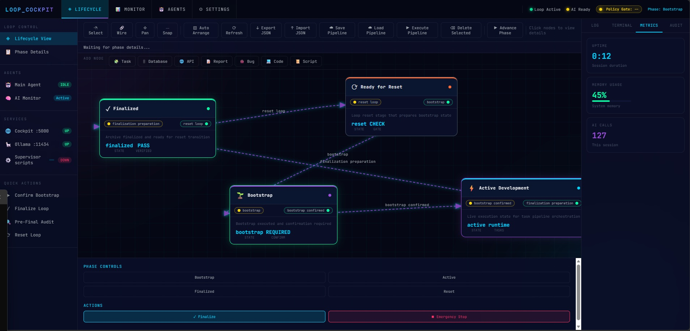

# Frontend Platform Design Zone

Flagship visual: `cover_autonomous_wf.jpg` (Autonomous Workflow Cockpit) from local design experiments.
Curated reference repository for frontend/platform design sheets.

## Contents
- index.html: visual gallery hub
- sheets/*.html: referenced design sheets from local workspace
- sheets/source_map.csv: provenance mapping

## Included References
- cockpit and network UIs
- axiom runtime and provenance views
- billing and curve visualizations

## Notes
This repo intentionally focuses on design reference artifacts and excludes heavy experiment folders except selected reference sheets.

